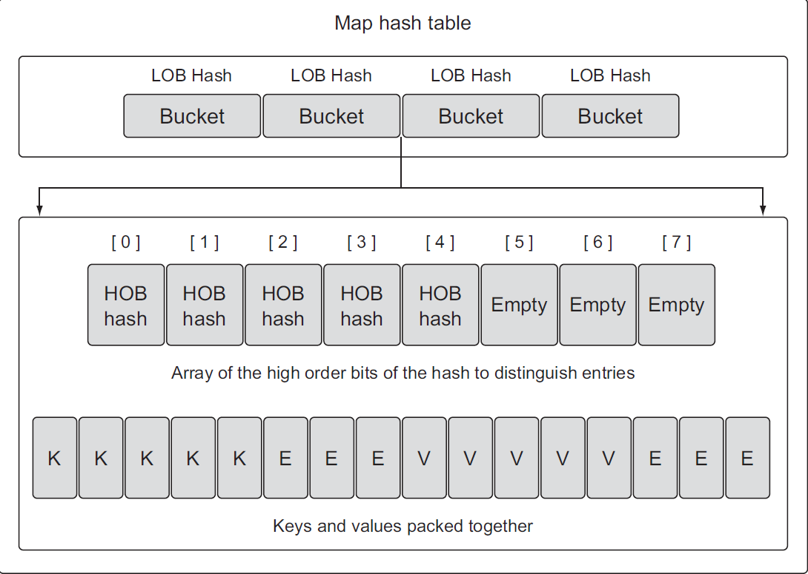
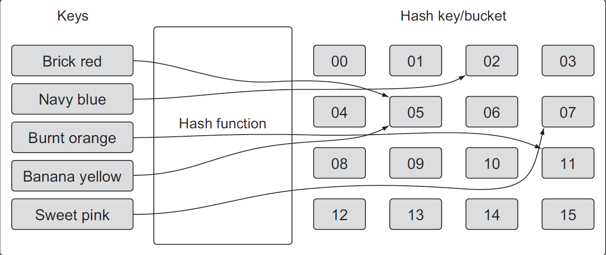

# Maps

Maps are un-orderd key-value pair data structure
keys are unique, but values are not, used for fast lookup and deletion


```go
// general syntax
var m map[K]V
k=> key type
V => v type


func main(){
    var m map[string]int
}
```

the zero value of map is `nil`.
A nilmap has no keys. Moreover, any attempt to add keys to a nilmap will result in a runtime error

## Initialization

1. Make functions
2. map literal

Slices, functions, and struct types that
contain slices can’t be used as map keys. This will produce a compiler error.
```go
// creating a map of string slice as a key
var mapp = map[[]string]int
    fmt.Println(mapp); // an error
// Create a map using a slice of strings as the value.
dict := map[int][]string{}; // valid
```
```go
func main(){
    var m = make(map[string]int )
    myMap := make(map[string] string) // shorthand syntax and common one

    var m = map[string]int {
        "a": 0,
        "b": 1, // note the last trailing comma is neccessary
    }
    myOtherMap := make(map[int]string){1: 'welcome', 2: 'another'}
}
```

```go
var colors map[string]string
    colors["red"] = "#0x0"; // can't add to nil map
    fmt.Println(colors); // error
    // empty map
    colorss := map[string]string{}
    colorss["red"] = "#0x0"
    fmt.Println(colorss)
```

we can make our custom types as well

```go
type User struct {
    Name string
}

func main(){
    var m = map[string]User{
        "a": User{"Peter"}, // we can remove "User" keyword
        "b": User{"Seth"},
    }
    fmt.Println(m);
    omar := User {
        Name: "Omar Mahmoud"
    }
    m["me"] = omar
    log.Println(m["me"].Name)
}

```

## Operations on Maps

1. Adding
2. Retrieving
3. Updating
4. Deleting
5. Iteration

**Adding**

```go
m[key] = v
m["c"] = User{"Steve"}

```

**Retrieving**
You can retrieve the
value and a flag that explicitly lets you know if the key exists.
The other option is to just return the value and test for the zero value to determine if
the key exists. This will only work if the zero value is not a valid value for the map
```go

c, ok := m["c"] // return a bool value indicate if the key exists also or not

// if you used a key that is not presen in the map?
// you will get the zero value of that map's type.
```

```go
colors := map[int]string{1: "red", 2: "green"}
    value, exists := colors[1]
    if exists {
        fmt.Println(`Exists`, value)
    }
     // or 
    if value != ""{
        fmt.Println(`exists`, value);
    }
```
**Updating**
by re-assigning

```go
m["a"] = "roger"
```

**deleting**
we can delete using the built-in `delete` function

```go
delete(map, key_to_be_deleted) //# doesn't return any value
```

**Iteration**
because maps are un orderd collection, it's not guaranteed that the result will be always the same every time we iterate

```go
func main(){
    var m = map[string]User{
        "a": {"Peter"},
        "b": {"meska"},
    }
    m["c"] = User{"Steve"}

    for k,v := range m {
        fmt.Println("Key: %s, Value: %v", key, value)
    }
}
```

## Properties

- maps are `reference` type

```go
package main

import "fmt"

type User struct {
 Name string
}

func main() {
 var m1 = map[string]User{
  "a": {"Peter"},
  "b": {"Seth"},
 }

 m2 := m1
 m2["c"] = User{"Steve"}

 fmt.Println(m1) // Output: map[a:{Peter} b:{Seth} c:{Steve}]
 fmt.Println(m2) // Output: map[a:{Peter} b:{Seth} c:{Steve}]

colors := map[string]string{
        "Red":   "#000",
        "Black": "#fff",
        "white": "#ccc",
    }
    removeColor(colors, "Red")

    for key, value := range colors {
        fmt.Printf("Key: %s, value: %s", key, value)
    }
}
func removeColor (colors map[string]string, key string){
    delete(colors, key)
}
```

** If you can't decide the type you want to store in maps, you can in fact use interface

```go
myMap := make(map[string] interface{});
```

but there's a catch, //TODO: search for it

### Internals

A map is implemented using a hash table.

The map's hash table contains collection of buckets


//TODO: read it again and search online

