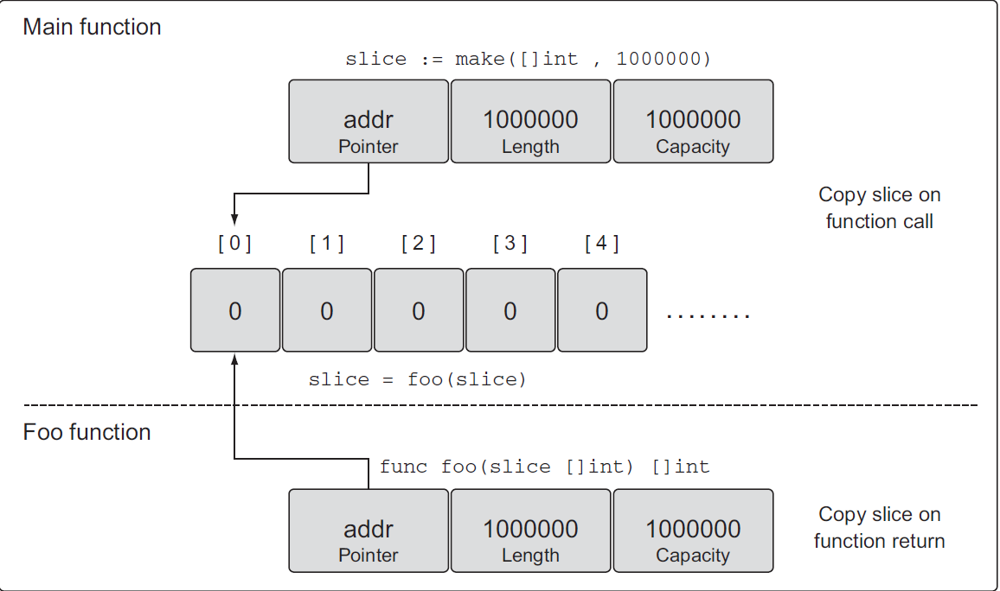
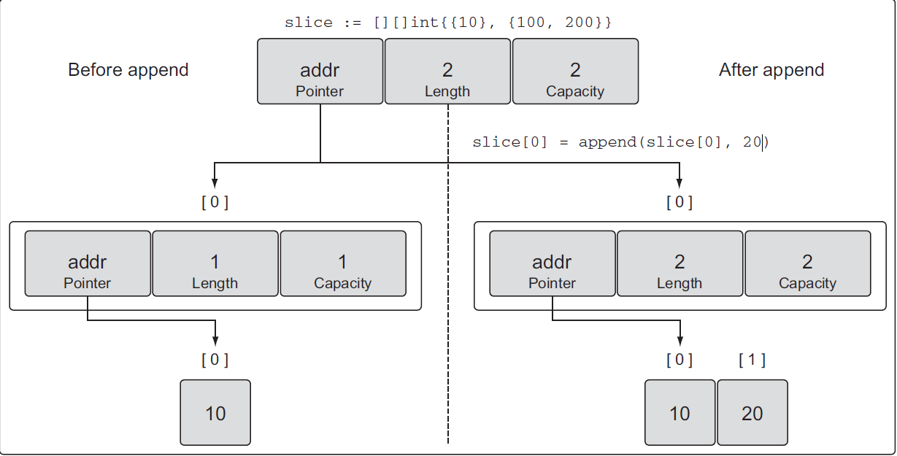

### Slices

A slice is a segment of an array, slices build on arrays and provide more power
Slices are the most common data structures used in go.


A slice consists of three things:

- A `pointer` reference to an underlying array.
- the lenght of the segment of the array that slice contains
- capacity which the maximum size up to which the segment can grow

```go
package main

import "fmt"

func main() {
 a := [5]int{1, 2, 3, 4, 5}

 s := a[1:4]

 fmt.Printf("Array: %v, Length: %d, Capacity: %d\n", a, len(a), cap(a))
 fmt.Printf("Slice: %v, Length: %d, Capacity: %d\n", s, len(s), cap(s))

}
```

we don't need to specify any length

```go
// general syntax
var s []T
```

unlike arrays, the zero value of the slice is not `zeros` but a `nil`

```go
var s []string
fmt.Println(s)// [] 
 fmt.Println(s == nil) //true
```

There are multiple ways to initialize our slice, One way is to use the built-in `make` function and the other way to define a `slice literal`.

```go
make([]T, len, cap) []T

func main()[
    var s = make([]string, 0,0)
]
```

```go
var s = []string {"Go", "Typescript"}
```

Another way is by creating a segment of array

```go
a[low:high]

func main(){
    var a = [4]string {
        "c++",
        "Go",
        "Typescript",
        "Java"
    }
s1 := a[0:2] // Select from 0 to 2
 s2 := a[:3]  // Select first 3
 s3 := a[2:]  // Select last 2
}
```

**note**:

- we can create a slice from another slice as well.
- we can iterate over slices as we iterate over arrays exactly

**Built-in slice functions**

- Copy: return the number of elemented copied
- Append: return a new slice containing all the elements

```go
//general syntax
copy(dst, src []T) int

package main

import "fmt"

func main() {

 s1 := []string{"a", "b", "c", "d"}
 s2 := make([]string, len(s1))

 e := copy(s2, s1)

 fmt.Println("Src:", s1)
 fmt.Println("Dst:", s2)
 fmt.Println("Elements:", e)
}
//output
Src: [a b c d]
Dst: [a b c d]
Elements: 4

```

```go
append(slice []T, elems ...T) []T

func main(){
    s1 := []string {"a", "b", "c", "d"}
    s2 := append(a1, "e", "f")

fmt.Println("a1:", a1)
 fmt.Println("a2:", a2)
    
}
```

**note**:
But if the given slice doesn't have sufficient capacity for the new elements then a new underlying array is allocated with a bigger capacity.

All the elements from the underlying array of the existing slice are copied to this new array, and then the new elements are appended.

#### properties

1. Slices are reference types, unlike arrays
=> modifying the elements of a slice will modify the corresponding elements in the referenced array.

```go
package main

func main(){
    a := [7]string {"Mon", "Tue", "Wed", "Thu", "Fri", "Sat", "Sun"}
    
    s := a[0:2]

    s[0] = "Sun"

    fmt.Println(a) // Output: [Sun Tue Wed Thu Fri Sat Sun]
    fmt.Println(s) // Output: [Sun Tue]

}
```

2. Slices can be used with variadic types

```go
package main

func main(){
    values := []int {1,3,4}
    sum := add(values...)
    fmt.Println(sum)

}

func add(values ...int) int {
    sum := 0
    for _, v :=range values {
        sum += v
    }
    return sum
}
```

-----------------------------------
/**Slices**/

### nil and empty slices

```go
// nil slice
 var slicee []int
 //empty slice
 emptySlice := make([]int, 0);
 anotherEmptySlice := []int{};

 // nil and empty slices are very useful in different situation
 // nil slice is used when a function should return a slice, but an exception occured
 // empty slice is used when a db query return 0 result [empty collection]
```

```go
 slice := make([]string, 5);
 // creates a slice of integers, containing a length of 3 and has a capacity of 5 elements
 anotherSlice := make([]string, 3, 5);
 anotherSSLice := []int{10, 20, 30}

 // initialize the 100th element with an empty string
 sslice := []string{99: ""};

```

### methods

```go
// methods [append, len and cap]

 slice := []int{10, 20, 30};
 newSlice := slice[1:2];
 // each slice now is sharing the same underlying array but each one of them is viewing it differently [potion of it]

 // how length and capacity is calculated
 // For slice[i:j] with an underlying array of capacity k
 // length: j - i;
 // capcaity: k - i;
 // slice[1:3] with underlying array of capacity 5
 // length: 3 - 1 = 2
 // Capacity: 5 - 1 = 4

 // changes made by the new slice is seen to the original one because they share the same underlying array

 /// append provide you with a new slice with the changesbut also the other slices sharing the same new array, will always increase the length of the new slice, the capacity on the other hand may or may not be affected, depending on the capacity of the source slice
 slice := []int{10, 20, 30, 40, 50};
 newSlice := slice[1:3];

 newSlice = append(newSlice, 60);

 /*When there’s no available capacity in the underlying array for a slice, the append function
will create a new underlying array, copy the existing values that are being referenced,
and assign the new value. */
slice := []int {10,20,30,40}; // capacity is only 4 and length 4
newSlice := append(slice, 50)
/*After this append operation, newSlice is given its own underlying array, and the capacity
of the array is doubled from its original size (see figure 4.15).
The append operation is clever when growing the capacity of the underlying array.
Capacity is always doubled when the existing capacity of the slice is under 1,000 elements.
Once the number of elements goes over 1,000, the capacity is grown by a factor
of 1.25, or 25%. This growth algorithm may change in the language over time.*/
```

### Slicing the slices

```go
slice := []int{10, 20, 30, 40, 50} // cap =54, length = 5
 fmt.Println(`Original Slice`, slice, cap(slice))
 newSlice := slice[1:3] // length 2, cap = 4
 fmt.Println(`newSlice`, newSlice)
 newSlice = append(newSlice, 60)
 fmt.Println(`newSlice after appending`, newSlice, cap(newSlice))
 fmt.Println(`slice after appending`, slice)

 // to increase capacity and length
 Slice := append(slice, 70)
 fmt.Println(Slice)
 fmt.Println(`slice after appending`, slice) // notice slice doesn't see changes made when appending to it and return Slice?
 // this because Go creates a new underlying array, copy the existing values that are being references and assign the new value.
 Slice[1] = 0
 fmt.Println(`slice after appending`, slice) // notice slice doesn't see changes made when appending to it and return Slice?

 fmt.Println(`capacity of Slice`, cap(Slice)) // doubled?
```

```go
 //* Multi-dimensional array
 slice := [][]int{{10}, {100, 200}}

 
```

### Three-index slices

This third index gives you control over the capacity of the new slice. The purpose
 is not to increase capacity, but to restrict the capacity. As you’ll see, being able to
 restrict the capacity of a new slice provides a level of protection to the underlying
 array and gives you more control over append operations

```go
 source := []string{"Apple", "Orange", "Banana", "Plum", "Grape"}
 slice := source[2:3:4] // length = 1, cap = 2
 // how length and cap calculaed
 // for slice[i:j:k] or [2:3:4]
 // length: j - i or 3 - 2 = 1
 // cap: k - i or 4-2 = 2
 // setting capacity larger than the avaiable capacity will get a runtime error
```

By having the option to set the capacity of a new slice to be the same as the length,
 you can force the first append operation to detach the new slice from the underlying
 array. Detaching the new slice from its original source array makes it safe to change

```go
 anotherSource := []string{"Apple", "Orange", "Banana", "Plum", "Grape"}
 anotherSlice := source[2:3:3] // leng = 1; cap = 1;
 slice = append(slice, "Kiwi") // appending to it will make new underlying array, so the slice now is detached
```

```go
 // append is variadic
 s1 := []int{1, 2}
 s2 := []int{3, 4}
 fmt.Printf("%v\n", append(s1, s2...))
```

### Iterating over slices

```go
 for index, value := range slice {
  fmt.Printf("Index: %d Value: %d\n", index, value)
 }
```

The keyword range, when iterating over a slice, will return two values. The first value
is the index position and the second value is a copy of the value in that index position
 It’s important to know that range is making a copy of the value, not returning a reference.
 If you use the address of the value variable as a pointer to each element, you’ll
 be making a mistake

```go
 slice := []int{10, 20, 30}
 for index, value := range slice {
  fmt.Printf("Value: %d Value-Addr: %X ElemAddr: %X\n", value, &value, &slice[index])
 }
 
```

you will notice that the value-addre is always the same, because it's a variable that contains a copy
if you need to the address the address of each individual element on the slice use &slice[index]

### Slices with functions

passing slices is the same as arrays, but much cheaper, Go copy the slice itself not the underlying array, as the underlying array is accessed using a pointer

```go

 slice := make([]int, 1e6)
 slice = foo(slice)

 func foo(slice []int) []int{
  ... 
  return slice
}
 ```



### Multi-dimensional Slices

```go
slice := [][]int {{10}, {100, 200}}; // len = 2, cap = 2
```


```go
slice[0] = append(slice[0], 20)
```


